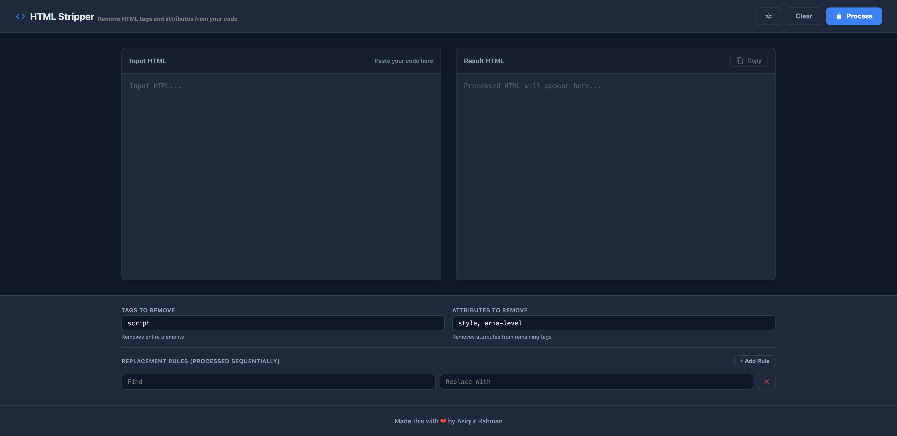

# HTML Stripper Pro

A powerful, client-side tool to clean up HTML code, strip specific tags/attributes, and perform advanced find & replace operations. Built with love by Asiqur Rahman.

## Features

- 🧹 **HTML Cleaning**: Easily remove specific tags (e.g., `<script>`, `<style>`) or attributes across the entire document.
- 🔍 **Advanced Find & Replace**: 
  - Create multiple find/replace rules.
  - Rules are processed sequentially.
  - Supports Global replacement.
- 🌓 **Dark/Light Mode**: Toggle between a sleek dark theme and a clean light theme. Auto-detects system preference.
- 💾 **Auto-Save**: all your settings (Tags, Attributes, Rules) are saved to your browser's Local Storage instantly. Never lose your configuration.
- ⚡ **Real-time & Fast**: Everything runs in the browser. No server-side processing.
- 📱 **Responsive Design**: Works great on Desktop and Mobile.

## Usage

1.  **Open**: Simply open `index.html` in any modern web browser.
2.  **Paste**: Paste your raw HTML into the Left panel.
3.  **Configure**:
    - Add tags to remove (comma separated).
    - Add attributes to remove.
    - Add custom Find/Replace rules if needed.
4.  **Process**: Click the **Process** button (top right).
5.  **Copy**: Click **Copy** in the Right panel to get your clean code.

## Technologies

- **HTML5**
- **CSS3** (CSS Variables for theming)
- **Vanilla JavaScript** (No external dependencies)

## License

This project is open source and available under the [MIT License](LICENSE).

---
Made with ❤️ by Asiqur Rahman
